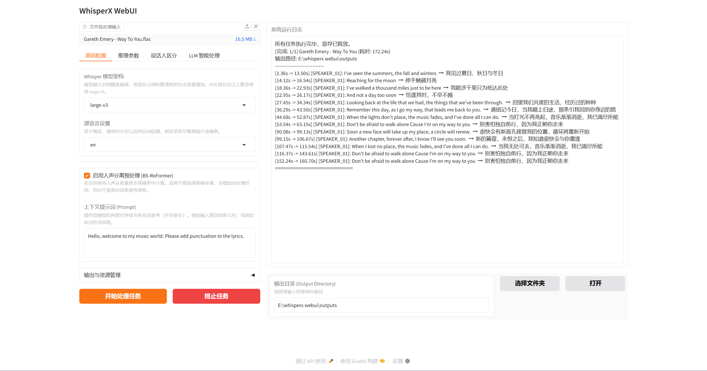

# WhisperX WebUI

**WhisperX WebUI** 是一个基于 `whisperx` 的离线/本地化音频转录与字幕生成工具。

它集成了 **人声分离（BS-RoFormer）**、**音素级强制对齐** 和 **说话人聚类（Pyannote）** 技术。通过直观的 `Gradio` 网页界面，你可以轻松地批量处理音频/视频文件，并导出 JSON 数据与 SRT 字幕。

## ✨ 界面效果展示：



运行效果存放在demo文件夹中

## ✨ 主要特性

- **🚀 核心转录**：基于 `whisperx` 的 ASR，支持音素级强制对齐（Phoneme-level Alignment），时间轴更精准。
- **🎵 人声分离**：内置 BS-RoFormer 预处理，可自动分离人声与背景音，显著提升嘈杂环境或歌曲的识别质量。
- **🗣️ 说话人区分**：可选说话人聚类（Speaker Diarization，基于 `pyannote`），自动识别不同的发言者。
- **📂 批量处理**：支持多文件队列处理，自动生成 JSON 与 SRT 字幕文件。
- **🛠️ 简易交互**：基于 Gradio 的可视化 WebUI，一键启动，无需记忆复杂命令行。

---

## ⚙️ 环境准备 (Prerequisites)

在开始之前，请确保你的系统已安装以下基础环境：

1.  **Python 3.10+**
2.  **FFmpeg** (必须)：用于音频格式转换。
    * *Windows*: 下载并配置环境变量，或确保 `ffmpeg.exe` 在系统路径中。
3.  **NVIDIA 显卡驱动 & CUDA**：建议安装 CUDA 12.x 以获得 GPU 加速支持。

---

## 🚀 快速开始 (Quick Start)

### 1. 克隆项目

```powershell
git clone https://github.com/AGT117/WhisperX-WebUI.git
cd WhisperX-WebUI

```

### 2. 创建虚拟环境 (推荐)

为了防止依赖冲突，建议创建独立的 Python 虚拟环境：

```powershell
# Windows PowerShell
py -3.11 -m venv .whisperx_webui
.\.whisperx_webui\Scripts\Activate.ps1
python.exe -m pip install --upgrade pip

# Linux / Mac
python3 -m venv .whisperx_webui
source .whisperx_webui/bin/activate

```

### 3. 安装依赖

```powershell
python -m pip install -r requirements.txt
pip install git+https://github.com/m-bain/whisperX.git --no-deps
pip install transformers
pip install tokenizers accelerate

```

> **注意**：如果安装 `whisperx` 失败，请确保你已安装 `git` 命令。

### 4. 配置 Hugging Face Token (可选)

如果你需要使用 **说话人聚类 (Speaker Diarization)** 功能，必须配置 Hugging Face Token：

1. 复制项目根目录下的 `.env.example` 文件，重命名为 `.env`。
2. 打开 `.env` 文件，填入你的 Token：
```ini
HF_TOKEN=hf_你的Token填在这里

```


*(注：你需要去 Hugging Face 官网接受:关键报错库：pyannote/speaker-diarization-community-1核心模型库：pyannote/speaker-diarization-3.1分割模型库：pyannote/segmentation-3.0 的用户协议)*

### 5. 启动应用

```powershell
python main.py

```

启动成功后，终端会显示访问地址（通常为 `http://127.0.0.1:7860`），浏览器会自动打开该页面。

---

## 📂 仓库结构

```text
WhisperX-WebUI/
├── main.py                  # 程序入口，应用补丁并启动 WebUI
├── requirements.txt         # 依赖清单
├── .env.example             # 配置文件模板
├── config/
│   └── settings.py          # 路径与默认配置 (HF缓存、CUDA设备等)
├── src/
│   ├── core/
│   │   ├── engine.py        # 核心引擎 (ASR, 对齐, 聚类, 分离)
│   │   └── utils.py         # 文本格式化与 SRT 导出工具
│   └── ui/
│       └── webui.py         # Gradio 界面逻辑
├── models/                  # 模型下载目录 (自动生成)
└── outputs/                 # 默认结果输出目录

```

---

## 🔧 配置说明 (`config/settings.py`)

你可以直接修改 `config/settings.py` 或通过环境变量调整默认行为：

* **`MODELS_DIR`**: 模型下载与缓存的根目录。
* **`HF_TOKEN`**: Hugging Face 令牌（建议在 `.env` 中配置）。
* **`DEVICE`**: 运行设备，默认为 `cuda`（无 N 卡可改为 `cpu`，但速度极慢）。
* **`COMPUTE_TYPE`**: 推理精度。
* `float16` (默认)：适合大多数 GPU。
* `int8`：显存不足时使用，精度略有下降。


* **`BATCH_SIZE`**: 转录时的批处理大小，显存越小该值应越小。

---

## 📝 常见问题 (FAQ)

**Q: 开启“说话人聚类”后报错？**

> **A:** 请检查：1. `.env` 文件中是否正确填入了 `HF_TOKEN`；2. 网络是否能连接 Hugging Face；3. 账号是否已在 Hugging Face 上签署了 `pyannote` 的使用协议。

**Q: 显存不足 (CUDA Out of Memory)？**

> **A:** 请在 WebUI 的“推理参数”中，将 **计算类型** 改为 `int8`，并尝试减小 **Batch Size**。

**Q: 如何处理带背景音乐的视频？**

> **A:** 请在界面勾选 **“启用人声分离预处理 (BS-RoFormer)”**。这会自动先提取人声再进行识别，虽然会增加耗时，但能显著提升准确率。

**Q: 程序启动时卡住不动？**

> **A:** 首次运行时程序需要下载 Whisper 和 Pyannote 模型，请耐心等待下载完成。


