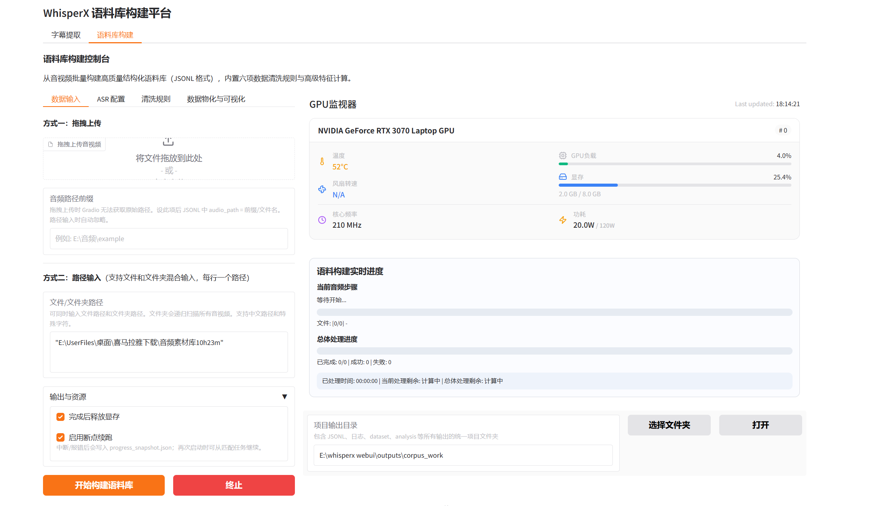

# WhisperX WebUI

本地化音视频转录与语料构建工具，基于 WhisperX，提供开箱即用的 Web 界面。



## 功能亮点

- 一键转录：音频/视频批量转录，导出 JSON + SRT。
- 对齐与分离：词级时间戳、说话人聚类、可选人声分离（BS-RoFormer）。
- LLM 增强：智能断句、翻译、幻觉过滤（OpenAI 兼容接口）。
- 语料构建：内置 A-H 清洗规则，自动导出 JSONL 数据集。
- 工程能力：断点续跑、任务终止、实时进度/ETA、GPU 监控。

## 处理流程

字幕提取：
输入文件 -> 转录/对齐 -> 可选过滤与 LLM -> JSON/SRT

语料构建：
输入文件 -> 转录/聚类 -> 清洗规则 -> 特征计算 -> JSONL -> 可选物化与可视化

## 环境要求

- Python 3.10+（推荐 3.11）
- FFmpeg（ffmpeg/ffprobe 需在 PATH 中）
- NVIDIA + CUDA（推荐，CPU 模式可运行但较慢）
- Hugging Face Token（启用说话人聚类时需要）

## 快速开始

```bash
# 1) 创建环境
python -m venv .venv
.venv\Scripts\activate

# 2) 安装依赖
pip install -r requirements.txt

# 3) 配置 .env（至少填写 HF_TOKEN 用于说话人聚类）
# 复制 .env.example 为 .env 后编辑

# 4) 启动
python main.py
```

启动后访问：

```text
http://127.0.0.1:7860
```

Windows 也可直接运行：

```text
start.bat
WhisperX-WebUI.exe
```

## LLM 配置（可选）

复制 config/llm_config.json.example 为 config/llm_config.json：

```json
{
  "api_base": "https://api.deepseek.com/v1",
  "api_key": "sk-...",
  "model": "deepseek-chat",
  "max_context_tokens": 8192,
  "temperature": 0.3
}
```

支持 OpenAI 兼容接口（OpenAI / DeepSeek / Ollama / vLLM）。

## 常用脚本

语料物化（JSONL -> WAV 切片）：

```bash
python scripts/materialize_corpus.py \
  --input-jsonl "outputs/corpus_work/<run_dir>/dataset_merged.jsonl" \
  --output-dir "outputs/My_Podcast_Dataset"
```

可视化分析：

```bash
python scripts/analyze_corpus.py \
  --merged-jsonl "outputs/corpus_work/<run_dir>/dataset_merged.jsonl" \
  --quality-stats "outputs/corpus_work/<run_dir>/quality_stats.json" \
  --output-dir "outputs/analysis"
```

## 输出说明

语料构建默认输出到：

```text
outputs/corpus_work/run_YYYYMMDD_HHMMSS/
```

其中包含：
- 单文件 JSONL / 合并 JSONL
- quality_stats.json（质量统计）
- progress_snapshot.json（断点续跑）
- terminal.log（运行日志）
- 可选 dataset/ 与 analysis/

## 许可证

本项目仅用于学习与研究，请遵守模型、数据与第三方依赖的许可证及服务条款。
